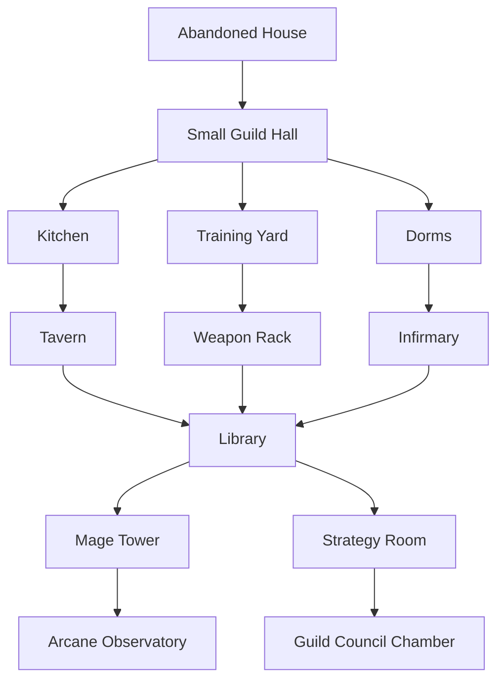
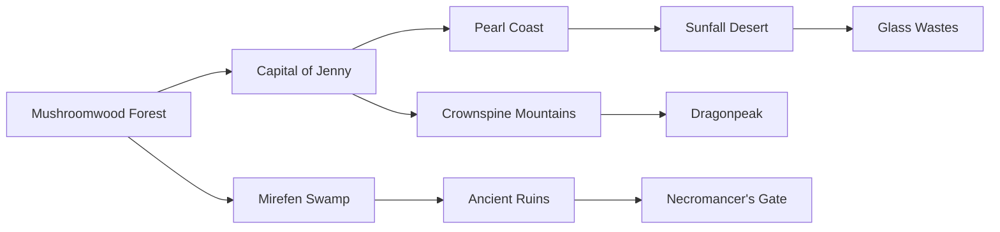
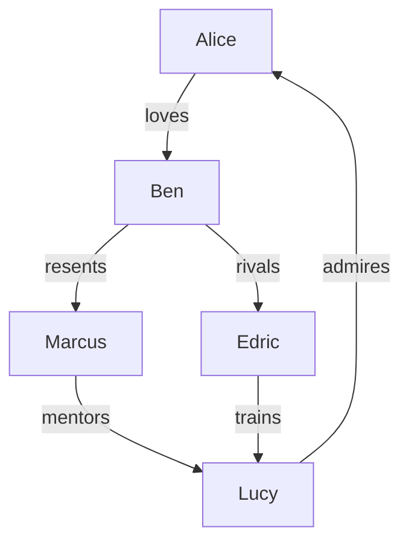

# Guildstead Design Reference

## North Star

Guildstead is a cosy fantasy guild management game where the player grows a small, scrappy guild into a legendary institution.

The management loop should be satisfying, but the heart of the game is persistent adventurers who age, bond, change, remember, and eventually leave a legacy.

## Design Pillars

1. A guild that visibly grows over time.
2. Adventurers who feel like people, not disposable units.
3. A world map that unlocks through roads, regions, and reputation.
4. Quests that create small stories, not just rewards.
5. Generational play, where apprentices and successors carry history forward.

## Core Loop

1. Recruit or develop adventurers.
2. Choose quests from the Quest Board or world map.
3. Send a suitable party.
4. Resolve outcomes, injuries, loot, fame, relationships, and story beats.
5. Upgrade the guild and unlock new facilities.
6. Expand into new regions.
7. Watch adventurers grow older, form bonds, mentor others, retire, or become legends.

## Guild Progression Tree

## Facility Roles

| Facility | Purpose | Unlocks |
| --- | --- | --- |
| Abandoned House | Starting base | Basic quests |
| Small Guild Hall | Core management | Recruitment and guild rank |
| Kitchen | Recovery and morale | Favourite food bonuses |
| Training Yard | Physical training | Warrior-style classes |
| Dorms | Capacity | More adventurers |
| Tavern | Social bonds | Rumours, bards, recruits |
| Weapon Rack | Equipment access | Weapon upgrades |
| Infirmary | Injury recovery | Better survival |
| Library | Knowledge and magic | Advanced quests, research |
| Mage Tower | Magical classes | Arcane quests |
| Strategy Room | Party planning | Better mission forecasts |
| Council Chamber | Late-game governance | Retired adventurer roles |

## World Map Structure

## Region Unlock Logic

| Region | Unlock Condition | Quest Tone |
| --- | --- | --- |
| Capital of Jenny | Start | Tutorial, errands, civic needs |
| Mushroomwood Forest | Start | Beasts, gathering, patrols |
| Pearl Coast | Fame 10 | Escorts, smugglers, sea monsters |
| Mirefen Swamp | Fame 20 | Poison, lost travellers, curses |
| Crownspine Mountains | Fame 30 | Harsh terrain, giants, mining |
| Ancient Ruins | Fame 45 | Relics, traps, lost history |
| Sunfall Desert | Fame 60 | Survival, mirages, ancient temples |
| Dragonpeak | Fame 80 | Dragons, legendary trials |
| Necromancer's Gate | Story unlock | Endgame threats |

## Adventurer Life Model

Each adventurer should have:

| Field | Example |
| --- | --- |
| Name | Edric |
| Age | 19 |
| Class | Warrior |
| Origin | Arrived with a rusty sword |
| Traits | Brave 5, Greedy 1, Lazy 2, Loyal 5 |
| Favourite food | Bread |
| Dream | Become a Dragon Slayer |
| Relationships | Friend, rival, mentor, spouse, apprentice |
| Scars | Lost an eye fighting a Lich |
| Legacy | Trained four apprentices |

## Generational Storytelling

The game should remember character history in short, readable beats.

Example timeline:

| Age | Event |
| --- | --- |
| 19 | Edric arrives with a rusty sword. |
| 22 | Edric defeats his first wyvern. |
| 26 | Edric mentors Lucy. |
| 31 | Edric loses an eye fighting a Lich. |
| 36 | Edric marries another adventurer. |
| 44 | Edric trains four apprentices. |
| 52 | Edric retires as a Dragon Slayer. |
| 53 | Edric joins the Guild Council. |

## Relationship Web

## Relationship Types

| Type | Gameplay Impact |
| --- | --- |
| Friend | Morale bonus when questing together |
| Rival | Training bonus, possible conflict |
| Mentor | Faster growth for apprentice |
| Spouse | Strong loyalty, retirement events |
| Family | Legacy and inheritance hooks |
| Enemy | Stress, refusal, event risk |

## UI Direction

The interface should feel like a modern management game with a toy-like fantasy surface.

Preferred structure:

1. Map as the main interaction layer.
2. Dock or radial menu for major sections.
3. Sliding or modal detail panels for actions.
4. Character cards with personality and history.
5. Event cards with choices and consequences.
6. Visible progression changes on the town and guild.

## Next Systems To Build

1. Guild progression tree and visible facility unlocks.
2. Region-based world map unlocks.
3. Quest library with difficulty, region, rewards, and tags.
4. Adventurer personality and age system.
5. Relationship system.
6. Equipment progression.
7. Monster bestiary.
8. Event card system.
